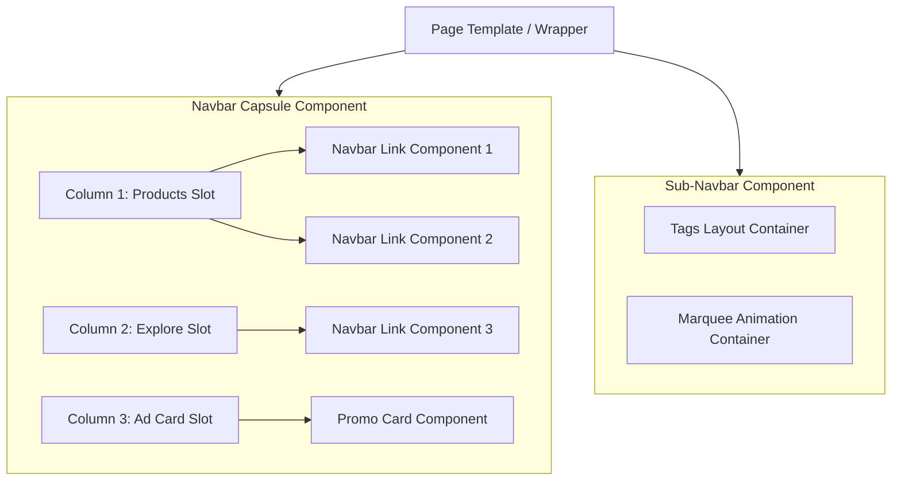

# Webflow Component Architecture Design

This document details the high-fidelity component specification, Webflow property mappings, and layout boundary structures for porting the scroll-reactive navigation system from the Kupper Sandbox to Webflow.

---

## 1. Component Boundaries & Architecture

To achieve clean maintenance, absolute styling reuse, and full CMS capability, we use the **Fine-Grained Atomic Components** approach. Each interactive layout is split into bounded components with strict inputs (properties).



---

## 2. Component Specifications

### A. Navbar Link Component (`Navbar Link`)
Recreates the `.nav-bar__big-li` lists dynamically.

* **HTML Structure Reference**:
  ```html
  <li class="nav-bar__big-li">
    <a href="{link-url}" class="nav-bar__big-a">
      <span class="nav-bar__big-span">{link-text}</span>
      <!-- Count Badge (Conditional) -->
      <span class="nav-bar__big-span-number">{number-text}</span>
      <!-- Tag Badge (Conditional) -->
      <div class="nav-bar__a-tag">
        <div class="tag">
          <div class="button-bg" data-wf--button-theme--variant="purple"></div>
          <span class="eyebrow is--relative">{tag-text}</span>
        </div>
      </div>
    </a>
    <!-- Underline Separator (Conditional) -->
    <div class="line is--nav-transparent"></div>
  </li>
  ```
* **Webflow Properties**:
  1. `link-text` (Type: Text) - The text label shown on hover.
  2. `link-url` (Type: Link) - Anchor or external link.
  3. `show-tag` (Type: Boolean) - Toggle visibility of the category badge.
  4. `tag-text` (Type: Text) - Customize badge text (e.g. "NEW").
  5. `show-number` (Type: Boolean) - Toggle count visibility.
  6. `number-text` (Type: Text) - Customize numeric value (e.g. "180").
  7. `has-divider` (Type: Boolean) - Toggle underline separator element.

### B. Sub-Navbar Component (`Sub-Navbar`)
A page-level component (`.under-nav-bar`) placed below the capsule. Supports two layout modes selectable via variant.

* **HTML Structure Reference**:
  ```html
  <div class="under-nav-bar">
    <div class="under-nav-bar__inner">
      <!-- Tags Layout Mode -->
      <div class="nav-tags-row">
        <div class="tags-left">
          <span class="tag is--category">{tag-category}</span>
          <span class="tag is--name">{tag-name}</span>
        </div>
        <div class="tags-right">
          <span class="tag is--status">{tag-status}</span>
        </div>
      </div>
      
      <!-- Marquee Layout Mode -->
      <a href="{marquee-link-url}" class="nav-marquee">
        <div class="marquee-css">
          <div class="marquee-css__list">
            <div class="marquee-css__item">
              <p class="eyebrow">{marquee-text}</p>
              <svg>...</svg>
            </div>
          </div>
        </div>
      </a>
    </div>
  </div>
  ```
* **Webflow Properties**:
  1. `layout-mode` (Type: Variant / Dropdown) - Options: `Tags` or `Marquee`.
  2. `tag-category` (Type: Text) - Category badge (e.g. "PRODUCT").
  3. `tag-name` (Type: Text) - Specific name (e.g. "BUTTON PACK").
  4. `tag-status` (Type: Text) - Status label (e.g. "✓ INCLUDED IN MEMBERSHIP").
  5. `marquee-text` (Type: Text) - Plain text to repeat dynamically.
  6. `marquee-link-url` (Type: Link) - Marquee click link.

### C. Promo Card Component (`Promo Card`)
The product advertisement banner card (`.nav-banner`) with play-on-hover video teasers.

* **HTML Structure Reference**:
  ```html
  <a href="{banner-url}" class="nav-banner">
    <div class="nav-banner__bg"></div>
    <div class="nav-banner__content">
      <div class="nav-banner__title">
        <h2>{banner-title}</h2>
      </div>
      <div class="nav-banner__ptc-preview" data-video-lazy-hover="">
        <video loop muted playsinline data-video-src="{video-src}" class="cover-video" preload="metadata"></video>
        <!-- Lock indicator (Conditional) -->
        <div class="ptc-card__locked">...</div>
      </div>
      <div class="nav-banner__btn">
        <button class="button">
          <span style="position: relative; z-index: 1;">{button-text}</span>
        </button>
      </div>
    </div>
  </a>
  ```
* **Webflow Properties**:
  1. `banner-title` (Type: Text) - Title header.
  2. `video-src` (Type: Link/Asset URL) - Dynamic video URL from CMS or files.
  3. `is-locked` (Type: Boolean) - Toggle lock indicator overlay.
  4. `button-text` (Type: Text) - CTA text (e.g. "More info").
  5. `banner-url` (Type: Link) - Target destination URL.

---

## 3. Persistent Page Structure (Barba.js Integration)

To prevent breaking layout states, theme colors, or animation instances during page swaps:

1. **Persistent Elements (Outside Barba container)**:
   * `transition` (Transition wipe overlay)
   * `nav` (Navbar Capsule Component)
   * *These elements remain untouched on page routing.*
2. **Dynamic Elements (Inside Barba container)**:
   * `under-nav-bar` (Sub-Navbar Component instance - allows varying text/modes per-page)
   * `main-content` (Page-specific sections)

---

## 4. Verification Plan

### Automated / Local Tests
1. **HTML Validation**: Verify that the elements match BEM class styles.
2. **Variant Toggles**: Check rendering behavior of the boolean visibility properties (`show-tag`, `show-number`, `has-divider`).

### Manual / Browser Verification
1. Open local sandbox page transition triggers to verify the navbar capsule holds its shrunk state while the sub-navbar transitions correctly.
2. Verify video hover triggers on the `Promo Card` do not leak memory or fail after page navigation.
