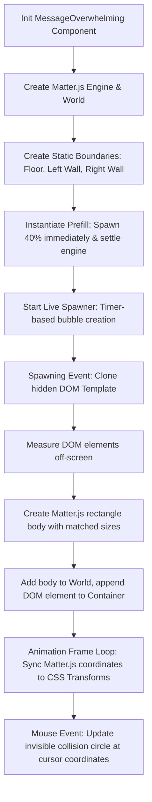

# Message Overwhelming Physics Section Design Spec

Design specification for creating the "Message Overwhelming" section with Matter.js physics integration, custom bubble elements, automatic time-based spawning, and mouse physics interaction, structured for clean export to Webflow.

## Goals

- Create a persistent sticky section containing a 2D physics world.
- Spawn custom message bubbles that fall, rotate, collide, and stack naturally at the bottom.
- Support responsive viewport sizes and handle resize events gracefully.
- Provide interactive mouse hovering where a physical cursor push-away force reacts with the message pile.
- Structure elements cleanly to allow easy export/migration to Webflow components via MCP.

---

## Architecture Overview

This section is built using a **Template Cloning** pattern. We define a single HTML/JSX structure for a message bubble, hide it as a template, and then dynamically clone it, measure it off-screen, and register it inside a Matter.js physics engine.



---

## Detailed Components & DOM Structure

To keep the structure clean for Webflow export, the HTML hierarchy uses descriptive class names matching Webflow's design system structure:

```html
<!-- Outer Scroll Container -->
<section class="overwhelming-track" style="height: 300vh;">
  <!-- Sticky Viewport Wrapper -->
  <div class="overwhelming-sticky" style="position: sticky; top: 0; height: 100vh; overflow: hidden; background-color: var(--color-light-gray, #dfe2e5);">
    
    <!-- Central Cards Area Placeholder (Target for Phase 2) -->
    <div class="overwhelming-center-content">
      <!-- Cards will sit here in Phase 2 -->
    </div>
    
    <!-- Physics Interaction Container -->
    <div class="overwhelming-physics-container" style="position: absolute; inset: 0; pointer-events: none;">
      <!-- Active falling message bubbles will be appended here -->
    </div>

    <!-- Hidden Spawning Template -->
    <div class="overwhelming-template-wrapper" style="display: none;">
      <div class="message-bubble" data-wf-variant="white">
        <span class="message-text"></span>
      </div>
    </div>
  </div>
</section>
```

### CSS Styling & Variables
- Background color of `.overwhelming-sticky` uses the DevLink light gray token (fallback `#dfe2e5`).
- Spacing, fonts, and message bubble borders are styled using class selectors:
  - `.message-bubble`: absolute positioned, `border-radius: 100px` (fully rounded corners), padding `0.75em 1.5em`, box-shadow, transition-less styling (handled by physics).
  - `.message-bubble[data-wf-variant="white"]`: background `#ffffff`, color `#201D1D`, border `1px solid var(--color-neutral-200)`.
  - `.message-bubble[data-wf-variant="blue-2"]`: background `#2051ff` (or Webflow blue variant), color `#ffffff`.

---

## Physics Engine & Spawning Logic

### 1. Engine Initialization
- Create a Matter.js engine and world instance:
  ```javascript
  const engine = Engine.create({ gravity: { y: 0.8 } });
  ```
- Build static bodies for the left boundary, right boundary, and floor (adjusted dynamically on window resize).
- Maintain an array of objects to map Matter.js bodies to their corresponding cloned HTML elements:
  ```javascript
  const bodiesToSync = []; // Array of { body, element }
  ```

### 2. Spawning a Bubble
- **Text content selection**: Select a random message string from an array of predefined messages.
- **Node Cloning**: Clone the `.message-bubble` template node, inject the text, and assign a variant attribute (`data-wf-variant="white"` or `data-wf-variant="blue-2"`).
- **Off-screen Measurement**:
  - Temporarily append the element to the document with visibility hidden to capture `getBoundingClientRect()`.
  - Get width and height.
- **Rigid Body Creation**:
  - Spawn at coordinates $(X_{spawn}, Y_{spawn})$.
    - **Desktop**: Randomly choose between top-left ($X \approx 10\%$) or top-right ($X \approx 90\%$) corners.
    - **Mobile**: Spawn only on the left side ($X \approx 15\%$).
  - Create a Matter.js body using `Bodies.rectangle(x, y, width, height, options)` with custom physical parameters (`restitution: 0.2` for subtle bouncing, `friction: 0.1`).
- **Insertion**: Remove off-screen node, append it to `.overwhelming-physics-container`, and add the body to the Matter.js world.

### 3. Prefill (40% Capacity)
- On initialization, calculate the target prefill count (e.g., 30 bubbles).
- Run a loop to instantiate these 30 bubbles at random vertical heights in the middle/lower half of the section.
- Run `Engine.update(engine, 1000/60)` synchronously ~120 times to simulate 2 seconds of physics simulation instantly, settling the elements at the bottom before making the wrapper visible.

### 4. Interactive Mouse repeller
- Create an invisible Matter.js circular body with a custom radius (e.g., `80px` in desktop, `40px` in mobile) in the physics world:
  ```javascript
  const mouseBody = Bodies.circle(0, 0, radius, { isStatic: true, isSensor: true });
  ```
- Bind a `mousemove` listener to the section. Update the mouse body's coordinates to track the mouse cursor.
- If the mouse leaves the section, move the body to an off-screen coordinate (e.g., $-1000, -1000$).
- Because `isSensor: true` is set, the repeller does not block other physics collisions but can apply a distance-based force or normal collisions to push the pile elements away. (Alternatively, leaving `isSensor: false` enables simple rigid pushing, which gives a very responsive result).

### 5. Loop Sync
- Inside the frame loop:
  ```javascript
  Engine.update(engine);
  bodiesToSync.forEach(({ body, element }) => {
    const { x, y } = body.position;
    const angle = body.angle;
    element.style.transform = `translate3d(${x - width/2}px, ${y - height/2}px, 0) rotate(${angle}rad)`;
  });
  ```

---

## Verification Plan

### Manual Verification Checklist
- Run local dev server (`npm run dev`).
- Visit `/overwhelming-sandbox.html` or the newly created dev page.
- Verify:
  - **40% Prefill**: On page load, a bunch of message bubbles are already resting at the bottom.
  - **Spawning**: New bubbles continue to pop up from left/right corners and drop down.
  - **Collisions**: Falling bubbles collide with boundaries and other bubbles, stacking realistically and rotating randomly instead of stacking perfectly square.
  - **Full Limit**: Spawning stops once the pile reaches a certain height or maximum count (e.g., 60-80 bubbles total).
  - **Mouse Interaction**: Moving the cursor through the pile pushes the messages aside.
  - **Mobile Layout**: Spawning occurs only on the left on narrow screens, and the pile boundaries scale down cleanly.
